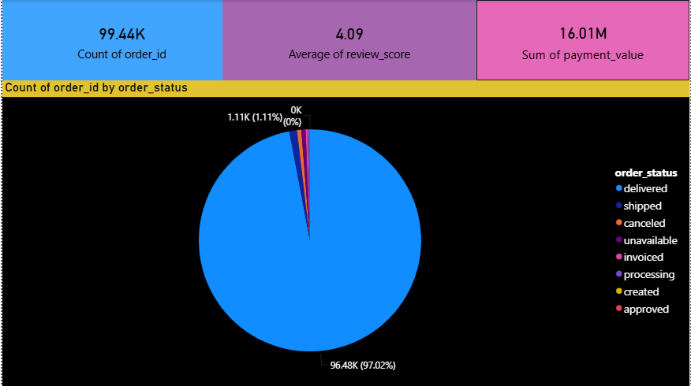
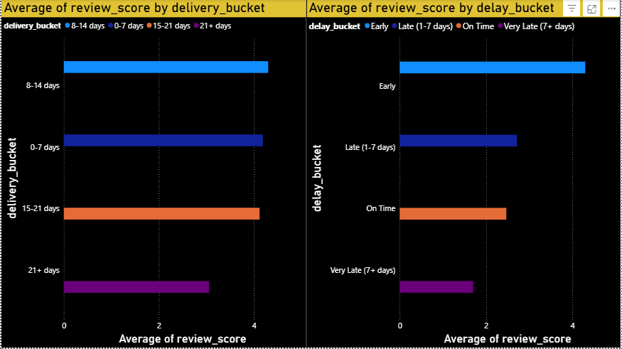
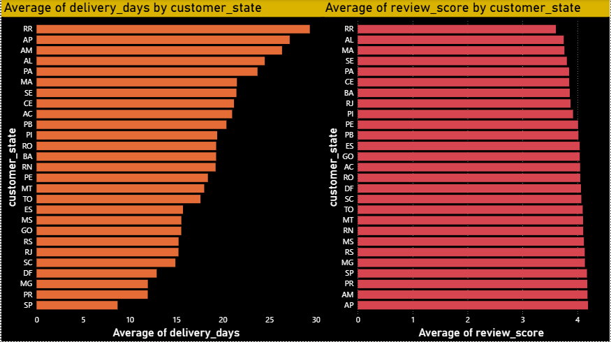

# Olist Customer Satisfaction & Delivery Analysis Dashboard

## Problem Statement
Analyzed e-commerce order data to identify key factors affecting customer satisfaction, with a focus on delivery performance and regional trends.

## Tools Used
- Power BI
- SQL
- Python (for data preprocessing)

## Key Dashboards
- Customer Satisfaction Overview
- Delivery Performance Analysis
- Regional Performance Analysis

## Key Findings

### 🚚 Delivery Delay is the Biggest Driver of Dissatisfaction
Customer satisfaction drops significantly as delivery delays increase. Orders delivered on time or early have average ratings above 4, while very late deliveries drop close to 2.

### 🌍 Regional Performance Varies Significantly
Certain regions consistently experience longer delivery times and lower review scores, indicating logistics inefficiencies.

### 📦 High Order Volume ≠ High Satisfaction
Regions with high order volumes do not always have high review scores, showing that scale without efficiency impacts customer experience.

### 📈 Strong Negative Correlation Between Delivery Time and Ratings
As delivery time increases, customer ratings consistently decrease, making delivery performance a key predictor of satisfaction.

## Business Impact
- Improving delivery timelines can significantly increase customer satisfaction
- Identifying high-delay regions helps optimize logistics operations
- Enables data-driven decision-making to improve customer experience and retention

## Dashboard Preview

### Customer Satisfaction Overview

### Delivery Performance Analysis

### Regional Performance Analysis

